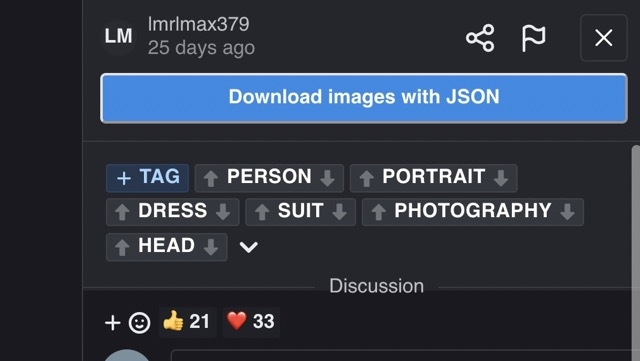
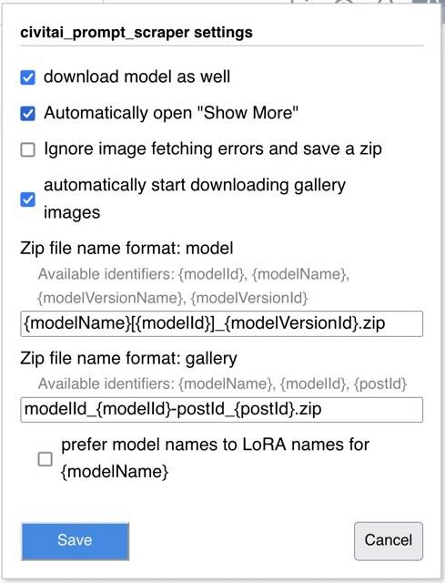
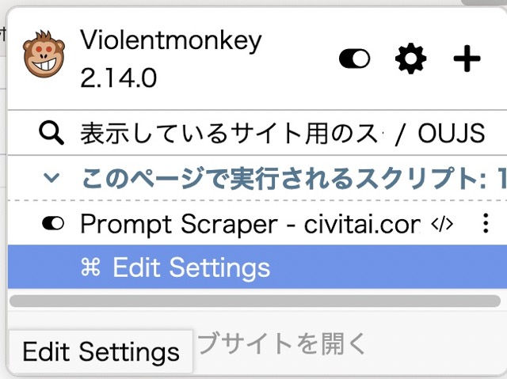

# 🤖civitai_prompt_scraper

Thi is an userscript to download images and metadata as a zip file.

This works for ViolentMokey in both Chrome and Firefox.

   

### **[Click here to install](https://github.com/craftgear/civitai_prompt_scraper/raw/main/dist/prompt_scraper.user.js)**.

   
   

It adds a download button on a model page to dowlonad preview images, preview images' metadata and model metadata.

You can also start downloading a model itself when you click the button.

   

Download button on a gallery page to download images and images' metadata.

   

Config panel.

   

Access config panel from Violentmonkey.

   

## ⚠️Caveats

- You need to wait for a few seconds to see a button.
- It is slow as it downloads files one by one.
- A tab downloading in progress should remain open, or downloading fails.
- It prioritizes downloading avif/webp.

## 🌟Special Thanks

This userscript is inspired by [tehrobber/civitai-one-click-dl](https://github.com/tehrobber/civitai-one-click-dl).
